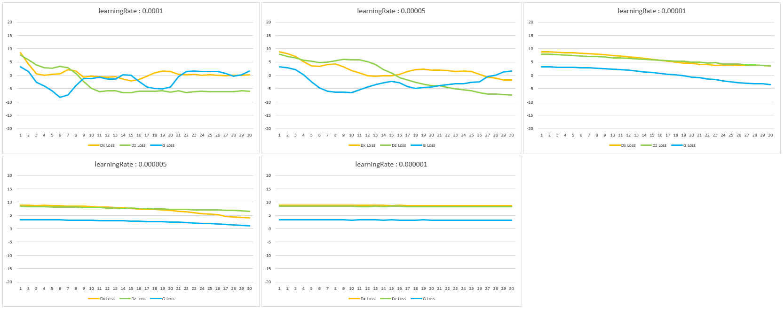
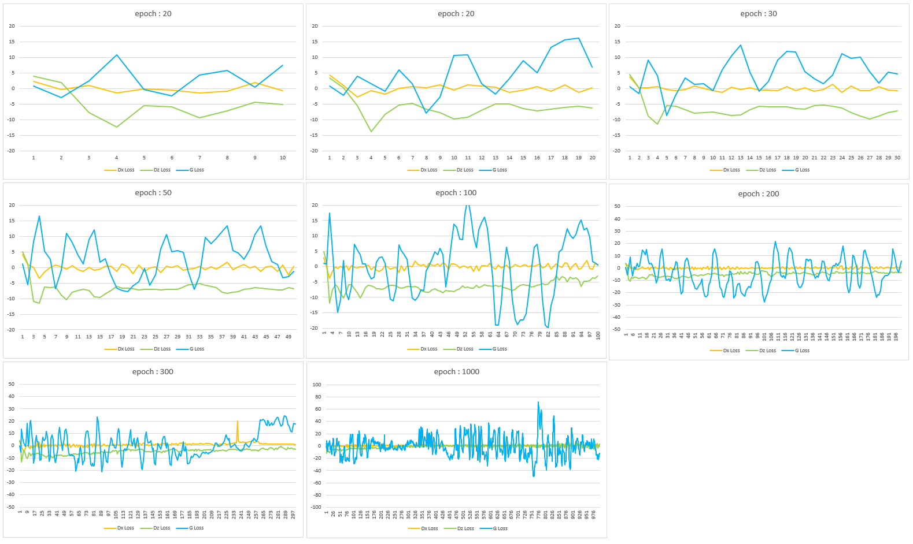
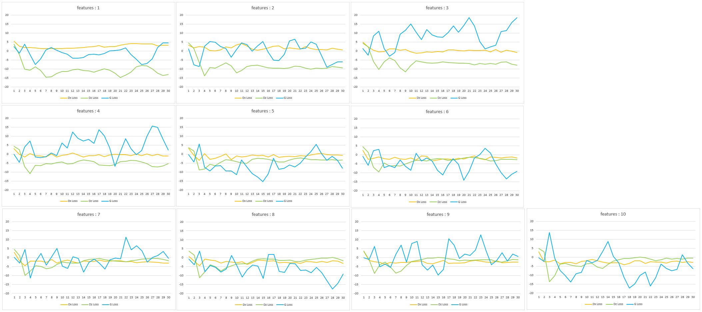
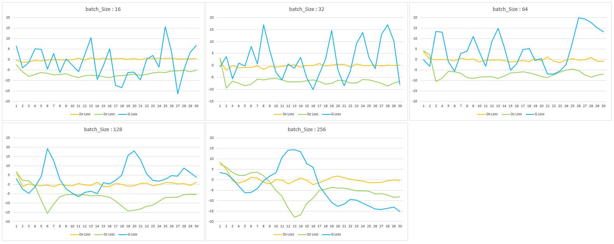
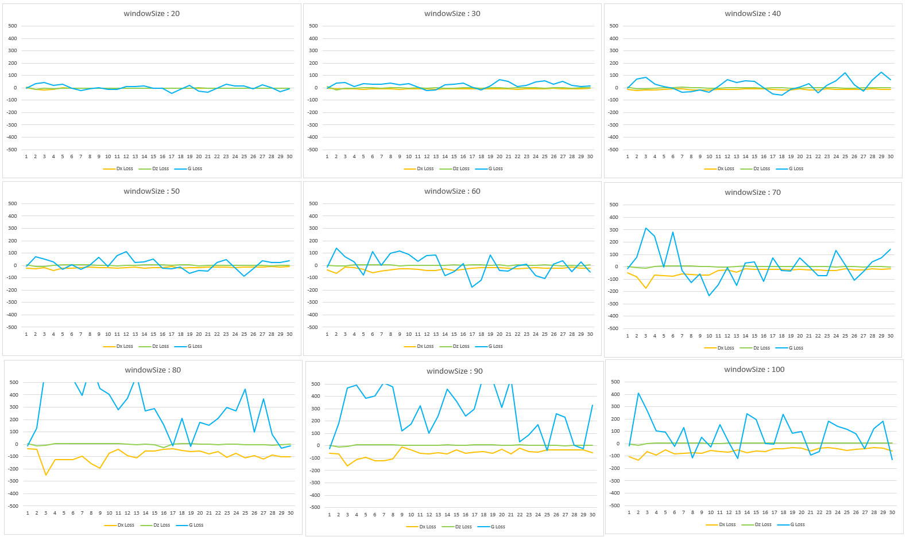
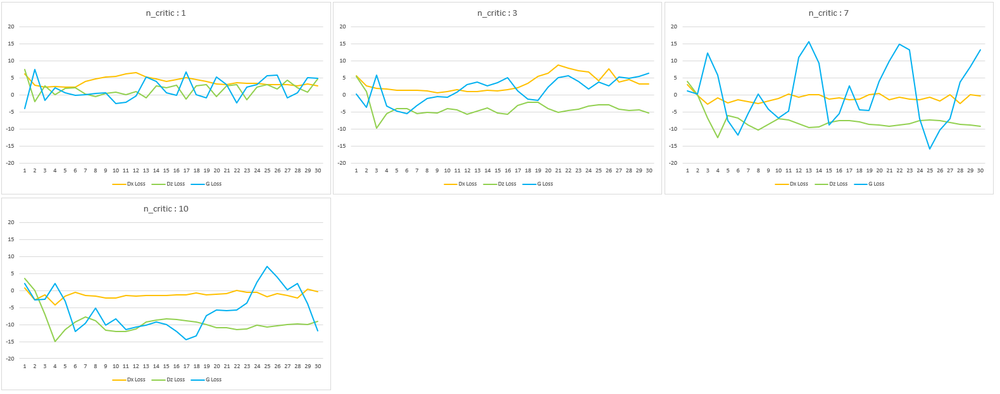

# Hyper Params Tuning

- Hyper parameter 수정에 따른 변동성 확인 시 learning rate에 따른 변화율 확인

  - 좌측 기준으로 0.0001, 0.000005, 0.000001
    - 0.0001 -> 매우 심한 진동 형태
    - 0.000005 -> 일정한 값으로 수렴해가는 형태
    - 0.000001 -> 비율이 너무 낮아 학습률이 저조한 상태

  

  - learning rate이 클 경우 epoch 값을 늘렸을 때 loss율이 진동하는 것을 확인

    
  

- learning rate의 Tuning 없이는 최적의 해의 값을 찾지 못할 것으로 판단
- 따라서, Hyper Parameter의 전체 그래프틑 먼저 분석 및 해석 후 learning rate 분석 진행할 것으로 결정

---

 

# Hyper parameter 별 최적화 기준 탐색

- 설정 기준 : 각 params별 변동 수치를 주어 Loss Value 변동성 확인

- 확인 결과 : learning Rate의 큰 변동성으로 인해 진동 형태의 그래프 확인, G-Loss Value 진동성 확인

- 변동 수치에 따른 세부 데이터 확인 [DataSheet](./LearningSheet.xlsx)

## 1. learning Rate

- 초기 Value 값(0.05) 에서 점점 낮은 Value로 탐색 (0.0001, 0.00005, 0.00001, 0.000005, 0.000001)

- 0.000001 값에서 낮은 학습율로 인한 변동 수치 없음 확인

- 0.00001 값에서 지속적으로 안정된 값으로 수렴 중임을 확인

## 2. epoch

- leanring Rate의 안정화 문제로 인한 반복 학습 시 학습 불안정성(Training Instability) 확인

## 3. features

- 변동 수치에 따른 특이사항 감지 불가

## 4. batchsize

- 변동 수치에 따른 특이사항 감지 불가

## 5. window Size

- window Size가 증가함에 따라 폭발적인 학습 불안정성 확인

## 6. n_critic

- 변동 수치에 따른 특이사항 감지 불가

