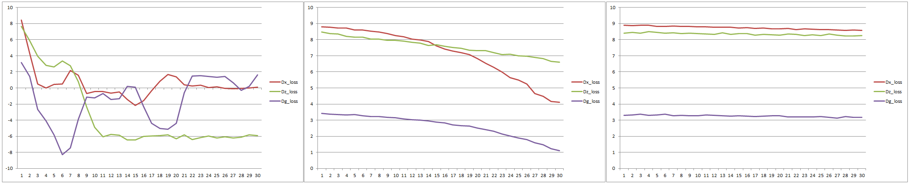
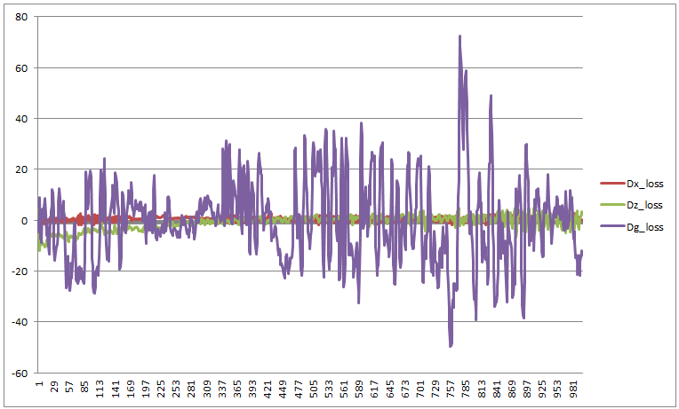

# Hyper Params Tuning 1주차

- Hyper parameter 수정에 따른 변동성 확인 시 learning rate에 따른 변화율 확인

  - 좌측 기준으로 0.0001, 0.000005, 0.000001
    - 0.0001 -> 매우 심한 진동 형태
    - 0.000005 -> 일정한 값으로 수렴해가는 형태
    - 0.000001 -> 비율이 너무 낮아 학습률이 저조한 상태

  

  - learning rate이 클 경우 epoch 값을 늘렸을 때 loss율이 진동하는 것을 확인

    
  

- learning rate의 Tuning 없이는 최적의 해의 값을 찾지 못할 것으로 판단
- 따라서, Hyper Parameter의 전체 그래프틑 먼저 분석 및 해석 후 learning rate 분석 진행할 것으로 결정
