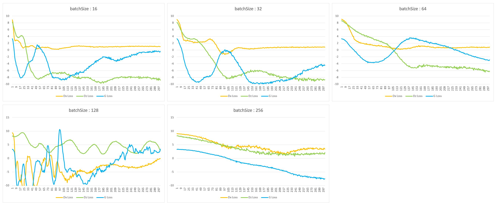
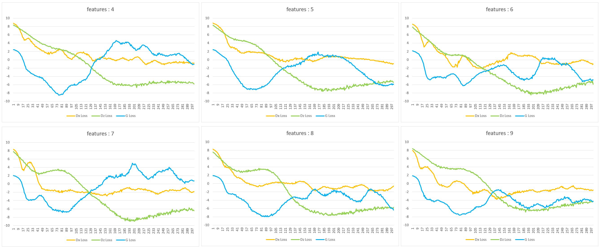
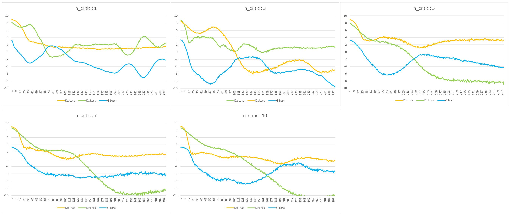

# Hyper Params Tuning

## 1. 파라미터 변동 및 고정 수치
- Learning Rate : 0.00001 고정
- epoch : 300 고정
- batch_Size : 16, 32, 128, 256 (현우)
- features : 3 ~ 10 (현우)
- n_critic : 1, 3, 7, 10 (준영)
- windowSize : 20, 30, 40, 50 (준영)
---

## 2. 파라미터 결과값

#### :pager: [Data](https://github.com/KAMP-Battery-Analysis/Code_Study/blob/main/Week_6/LearningSheet2.xlsx) - 데이터 excel 정리 결과

#### 1. batch_Size

|담당자|내용|의견|
|--|--|--|
|복현우|내용 기입|내용 기입|
|박준영|내용 기입|내용 기입|

#### 2. features

|담당자|내용|의견|
|--|--|--|
|복현우|내용 기입|내용 기입|
|박준영|내용 기입|내용 기입|

#### 3. n_critic

|담당자|내용|의견|
|--|--|--|
|복현우|내용 기입|내용 기입|
|박준영|내용 기입|내용 기입|

#### 4. window_Size

|담당자|내용|의견|
|--|--|--|
|복현우|내용 기입|내용 기입|
|박준영|내용 기입|내용 기입|

